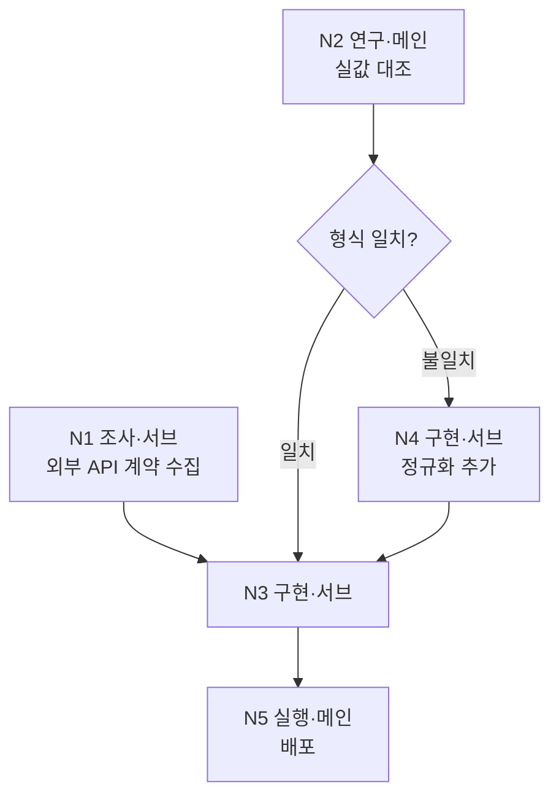

# /dev

여러 `/clear` 세션에 걸치는 개발을 지휘한다. 계획 세션에서 작업을 **노드 흐름도**로 배치하고, 노드 단위로 실행·위임한다.

## 핵심 개념

- **노드 = 작업 단위.** 종류·주체·선행·분기조건·상태를 가진다.
- **세션 = 대화 단위.** 본 스킬은 세션을 스스로 열지 않는다. 한 `/dev` 호출은 실행 가능한 노드를 처리하고 '세션 경계 규칙'에 따라 정지·인수인계한다.
- **DEV_PLAN = 인수인계 장부.** 흐름도(mermaid)와 노드 표를 함께 싣는다. 실행 판단은 **노드 표**로 하고, 흐름도는 사람이 보는 그림이다.
- **컨텍스트 예산(200K)은 메인 세션에 쌓이는 양 기준으로 관리한다.**

## 산출 위치

- 개발 계획서: `<프로젝트 루트>/docs/dev/plan/DEV_PLAN-NNN-<slug>.md`
- 노드 결과(서브 위임분): `<프로젝트 루트>/docs/dev/plan/nodes/<노드ID>.md`
- 사전 조사: `<프로젝트 루트>/docs/dev/research/<slug>.md`
- 프로젝트 루트: `git rev-parse --git-common-dir`의 부모. 비-git이면 cwd. `<slug>`는 영문 소문자 kebab-case.

## 노드 종류

| 종류 | 기본 주체 | 실행 방법 |
|------|----------|----------|
| 조사 | 서브 | 자료 수집·정리. `researcher`(좁히기 필요) 또는 `Explore`·`general-purpose` |
| 연구 | 메인 | 직접 돌려 결론을 얻는다. 결과가 분기를 만든다 |
| 설계 | 메인 | `/adr` |
| 디자인 | 사용자 | 시안은 사용자가 확정하고 **메인이 구현용 사양서로 정규화한다.** 구현 노드는 시안이 아니라 사양서를 입력으로 받는다 |
| 구현 | 서브 | `/impl` |
| 실행 | 메인 | 비가역 1회성 조작 — 데이터 보충·이관, 병렬 노드 합류, 배포. 백업·복구 경로 확인이 통과 조건 |

**조사와 연구는 실험 포함 여부로 가른다.** 자료를 모아 정리하면 조사, 직접 돌려 봐야 결론이 나면 연구.

**배포는 실행 종류의 끝단 사례다.** 직전 구현 노드가 회귀를 마쳤으므로 테스트 스위트를 다시 돌리지 않는다.

## 주체 판정

노드 종류 표의 `기본 주체`를 쓰되, 아래에 걸리면 그것으로 덮어쓴다(위에서부터 먼저 걸리는 것).

1. 사람만 할 수 있다(육안 대조·실환경 확인·시안 선택) → **사용자**
2. 다른 프로젝트·타인이 해야 한다 → **외부**
3. 사용자에게 선택지를 물어야 하거나, 서브를 스폰해 판단·종합해야 한다 → **메인**

## 위임 실행 모드

`--resume`으로 호출됐고 args에 처리할 노드 ID와 DEV_PLAN 갱신 금지가 **함께** 명시됐으면 위임 실행이다. 회신할 호출자 주소가 확보되지 않으면 위임 실행으로 보지 않고 평소 진입 분기를 따른다 — 대화 중 비슷한 표현이 나왔다고 전환하면 없는 호출자에게 묻다 멈춘다. 아래를 적용하고, 그 외 절차는 평소대로 따른다.

- **DEV_PLAN을 갱신하지 않는다** — 노드 표·흐름도뿐 아니라 frontmatter `status`·후속·유보 섹션도 건드리지 않는다. 결과·계획 변경 제안·발견한 후속·유보 항목은 모두 `nodes/<노드ID>.md`에 적고, DEV_PLAN 반영은 호출자에게 맡긴다.
- **지정된 노드 1개만 처리하고 정지한다.** '세션 경계 규칙'의 연속 처리 판정과 `/clear` 재개 안내를 적용하지 않는다.
- **사용자에게 직접 묻지 않는다.** 결정·확인이 필요하면 위임 메시지의 발신자 주소로 `SendMessage` 회신해 묻고 답을 기다린다 — 화면 출력은 아무에게도 도달하지 않는다.
- **되돌릴 수 없는 조작은 수행하지 않는다.** 배포·데이터 이관·브랜치 합치기가 필요하면 실행하지 말고 호출자에게 반환한다.

> **Do:** 노드 표·흐름도·`status` 필드는 그대로 두고 `nodes/<노드ID>.md`에만 쓴다
> **Don't:** Phase 2 step 6·7의 상태 갱신·`status: done` 전환을 위임 모드에서도 실행한다

## 진입 분기 (매 호출, 메인 직접)

1. `--resume <경로>`가 있으면 그 계획서를 사용한다. 없으면 `docs/dev/plan/`을 스캔한다.
2. `status: in-progress` 계획서가 있으면 → **재진입(Phase 2)**. 2개 이상이면 제목을 1줄씩 보여주고 어느 것을 이어갈지 질문 후 답 대기.
3. 없으면 → **신규(Phase 1)**.

## Phase 1 — 계획 세션 (신규)

1. **대화형 인테이크.** 사용자와 구현 범위·제약을 확정한다. 모호한 점만 질문하고 명확하면 넘어간다.
2. **발견 우선 배치.** 외부 계약·실측치·전제 검증을 각각 조사·연구 노드로 세워 **입력이 갖춰지는 가장 이른 지점**에 놓는다. 구현 노드의 선행 확인 항목으로 묻지 않는다.
3. **성공 조건 (선택).** 사용자가 언급했을 때만 대화로 확정해 기록한다.
4. **ADR 필요 판정.** 저장소·데이터 모델·API 계약·인증 경계·주요 라이브러리·모듈 경계를 신규 도입·변경하면 설계 노드를 넣는다. 기존 구조 내 확장·리팩토링뿐이면 생략.
5. **노드 배치.** "병렬 배치 규칙"·"분기 배치 규칙"을 적용해 흐름도와 노드 표를 만든다.
6. **DEV_PLAN 작성.** "DEV_PLAN 표준 구조"로 Write한다. NNN은 `docs/dev/plan/` 내 최대 번호 +1(3자리, 없으면 001), status는 `in-progress`.
7. **세션 경계 판단** ("세션 경계 규칙").

## 병렬 배치 규칙

- **조사·연구 노드는 선행이 같으면 병렬이 기본이다.** 읽기 전용이라 서로 밟지 않는다.
- **구현 노드를 병렬로 놓으려면 아래 둘을 모두 만족해야 한다.** 하나라도 못 보이면 직렬로 둔다.
  1. 각 노드가 건드릴 파일 집합을 노드 표에 이름으로 적고 교집합이 비어 있다.
  2. 각 노드의 **단위·통합** 테스트가 고정 포트·공유 DB 파일·외부 서비스를 동시에 잡지 않는다. e2e는 합류 노드로 미루므로 병렬 배제 사유가 아니다.
- **검증 노드를 따로 두지 않는다** — 구현 노드가 `/impl` 내부에서 단위·통합을 거치고, e2e는 합류 노드가 담당한다.

> **Do:** 파일 집합을 못 적거나 단위·통합 테스트 자원이 겹치는 구현 노드 2개는 직렬로 잇는다
> **Don't:** 기능이 달라 보인다는 이유로 병렬 배치하거나, 구현 노드 뒤에 별도 검증 노드를 단다

### 병렬 구현 노드의 격리와 합류

구현 노드를 **병렬로 실행할 때만** 적용한다. 단독 실행이면 워크트리를 만들지 않고 메인 워킹트리에서 `/impl`을 그대로(e2e 포함) 돌린다.

1. 메인이 노드마다 워크트리를 만든다 — `git worktree add <경로> -b node/<노드ID>`.
2. 그 워크트리를 작업 위치로 `/impl`을 실행하고, 위임에 **"evaluator·e2e는 상위 합류 노드에서 수행한다. 통합 code-reviewer 통과 시점에 종료하라"** 를 명시한다. 나머지 단계(계획·단위·리뷰·트랙 머지·통합)는 노드 워크트리 안에서 평소대로 닫힌다.
3. 노드가 끝나면 `node/<노드ID>` 브랜치에 커밋만 남는다.
4. **합류 노드**(종류=실행, 주체=메인, 선행=병합 대상 구현 노드 전체)에서 메인이 순서대로 처리한다.
   1. 노드 브랜치를 하나씩 머지한다. 충돌하면 멈추고 사용자에 보고하며, 해소 후 **그 노드 머지부터** 재개한다.
   2. 전체 테스트 스위트를 1회 돌린다.
   3. `evaluator` 스폰 — 위임에 **노드별 워크스페이스 경로 목록**(각 `03_plan.md`의 E2E 골격을 Read하도록)과 DEV_PLAN의 성공 조건을 전달한다. 산출 경로를 e2e 에이전트에 넘겨 스폰한다(에이전트 선택은 `/impl` 7단계 규약과 동일). e2e가 없는 프로젝트면 3·4를 생략.
   4. e2e 실패 시 실패 시나리오가 닿는 파일을 노드 표의 `담당 파일`과 대조해 원인 노드를 지목하고, 그 노드를 `실패`로 되돌려 재실행한다. **대조로 특정되지 않으면 합류 노드를 `실패`로 두고 사용자에 보고한다** — 임의로 지목하지 않는다.

노드 결과 파일은 **그 노드 워크트리 안의** `docs/dev/plan/nodes/<노드ID>.md`에 쓴다. 메인은 절대경로로 읽고, 머지 시 함께 들어온다.

> **Do:** 병렬 노드는 통합 리뷰까지, e2e는 합쳐진 트리에서 한 번만 돌린다
> **Don't:** 병렬 노드가 각자 e2e를 돌리게 하거나, 서브·러너에게 메인 워킹트리로의 머지를 시킨다

## 분기 배치 규칙

- **분기 자체는 노드가 아니다.** 흐름도에는 마름모로 그리되 노드 표에 행을 만들지 않는다. 갈래마다 후속 노드를 두고, 그 노드의 `선행`에 판정할 연구 노드를, `조건` 칸에 갈래를 적는다.
- 갈래를 예상할 수 없으면 **재계획 노드**(종류=연구, 주체=메인) 하나만 두고, 결과가 나온 뒤 메인이 흐름도와 표를 확장한다.
- 갈래가 확정되면 선택되지 않은 쪽 노드의 상태를 **건너뜀**으로 바꾼다. 그대로 두면 계획이 완료 판정을 받지 못한다.

## Phase 2 — 노드 실행 (재진입)

1. DEV_PLAN을 Read하고 **선행이 모두 완료·건너뜀이면서 상태가 대기**인 노드를 모두 찾는다.
2. **분기 정리.** 그중 `조건` 칸이 채워진 노드는 선행 노드의 결과로 조건을 판정한다. 충족한 것만 실행 대상으로 남기고, 나머지 갈래는 상태를 `건너뜀`으로 바꾼다.
3. 사용자에 1줄 보고 후 진행 ("실행 가능: N4 구현·서브, N5 조사·서브. 병렬로 진행합니다").
4. 주체별 처리:
   - **서브 노드가 여럿** → 한 응답에 묶어 병렬 스폰 ("서브 노드 위임 규칙").
   - **메인 노드** → 하나씩 처리한다.
   - **사용자·외부 노드** → 필요한 것을 안내하고 상태를 `진행`으로 두고 다른 실행 가능 노드로 넘어간다. 그것만 남으면 정지·안내.
5. 종류별 실행:
   - **설계** → `/adr`을 Skill로 호출. 결정 문제·배경·후보안·(있으면) 조사 노드 산출 경로를 전달. 산출 ADR 경로를 `## 아키텍처 결정`에 기록.
   - **구현** → `/impl`을 Skill로 호출. 전달: ① 구현 범위 ② (있으면) 확정 ADR 경로 — `/impl`이 설계 단계를 생략하고 채택한다 ③ (있으면) 그 노드에 배분된 성공 조건 원문. 중단된 노드면(노드 표에 워크스페이스 경로 기록) `/impl --resume <경로>`로 이어간다. 반환된 워크스페이스 절대경로를 노드 표에 기록. **병렬 배치된 노드면 "병렬 구현 노드의 격리와 합류"를 따른다.**
   - **실행** → 되돌릴 수 없는 조작이면 백업·복구 경로를 먼저 확인한다. 확인되지 않으면 사용자에 보고하고 대기. **합류 노드면 "병렬 구현 노드의 격리와 합류" 4번을 따른다.**
6. **회수·갱신.** 서브 노드면 `nodes/<노드ID>.md`를 Read해 `## 계획 변경 제안` 절이 있는지 확인한다. **병렬 노드는 그 노드 워크트리의 절대경로로 읽는다.** 제안이 있으면 DEV_PLAN에 반영하거나 사용자에 1줄 보고한다. 이어서 노드 상태를 갱신한다.
7. **후속·유보 처리** ("후속·유보 작업"). 전 노드가 완료·건너뜀이면 `status: done`으로 바꾸고, 후속 작업에 `[ ]` 항목이 남아 있으면 완료 보고에 함께 출력한다.
8. **세션 경계 판단** ("세션 경계 규칙").

## 서브 노드 위임 규칙

- 위임 프롬프트에 **노드 ID·작업 범위·산출 경로·(구현이면) 담당 파일 집합**만 준다. DEV_PLAN 본문을 발췌해 넣지 않고 경로 Read를 지시한다.
- 서브는 **노드 실행 결과와 계획 변경 제안**을 `docs/dev/plan/nodes/<노드ID>.md`에 쓴다. 하위 스킬(`/impl`·`/adr`)의 고유 산출물은 그 스킬 규약의 경로를 따른다.
- **DEV_PLAN은 읽기만 한다.** 계획을 바꿔야 한다고 판단하면 노드 파일의 `## 계획 변경 제안` 절에 사유를 적고 보고만 한다.

> **Do:** 서브는 자기 노드 파일만 쓰고, 계획 변경은 제안으로 올린다
> **Don't:** 서브가 DEV_PLAN의 노드 표·흐름도를 직접 고치거나, 위임 범위 밖 노드의 결과를 적는다

## 세션 경계 규칙

- **무게 판정은 메인이 직접 실행한 노드에만 적용한다.** 서브 노드는 요약만 회수하므로 무게에 세지 않는다.
  - **무거움**: 연구 노드 / 실행 노드 / 메인 직접 작성 경로의 설계 노드 / 대화 인테이크 왕복 5회 이상
  - **가벼움**: 서브 노드 회수 / synthesizer 경유 설계 노드 / 왕복 4회 이하 대화
- 정지·계속 판단은 방금 끝낸 노드의 **실제 진행**으로 한다.
- 한 노드를 마칠 때마다:
  - 방금 마친 것이 무거움 → **정지**. 계획서 갱신 + "`/clear` 후 `/dev`로 이어가세요" 안내.
  - 방금 마친 것이 가벼움 + 다음 실행 가능 노드도 가벼움 → Phase 2 step 1로 돌아가 이어 실행.
  - 다음 실행 가능 노드가 무거움 → 정지·안내. 실행 가능 노드 없음 → 대기 중인 사용자·외부 노드를 안내하거나 완료 보고.
- **세션 종료 커밋.** 정지·완료로 세션을 끝내기 직전, 작업 트리에 미커밋 변경이 있으면 커밋한다 — 태그는 생성하지 않는다(전역 커밋·태그 규칙의 사이클 태깅을 `/dev` 세션 종료 커밋에 한해 면제). 미커밋 변경이 없으면 생략.

> **Do:** 무거운 노드 하나로 그 세션을 끝내고, 미커밋 변경은 커밋만 남긴다
> **Don't:** 한 호출에서 무거운 노드 2개를 연달아 처리하거나, 태그를 붙이거나, 커밋 없이 다음 세션으로 넘긴다

## 후속·유보 작업

노드 실행 중 작업이 식별되면 DEV_PLAN의 전용 섹션에 성격별로 나눠 append한다.

- **후속 작업** — 해야 하지만 이번 계획서 범위 밖으로 미루는 작업. 계획 완료를 막지 않는다.
- **유보 작업** — 중요도가 낮고 현재 사용자 경험에 영향이 없으나 개선 여지가 있는 항목(코드 리뷰 minor 등급 상당).

노드 진행 자체는 노드 표에만 기록·갱신한다.

> **Do:** "해야 하는데 이번엔 안 함"은 후속, "안 해도 되지만 하면 나아짐"은 유보로 나눠 적는다
> **Don't:** 후속·유보를 한 목록에 섞거나 노드 표에 끼워 넣거나, 계획서 밖 파일에 기록한다

## 조사·연구 노드 판정

아래 중 하나라도 해당하면 코드 작성 전에 노드를 세운다.

- 학습 컷오프(2026-01) 이후 빠르게 바뀌는 외부 기술 의존 — 라이브러리·프레임워크 버전, LLM/AI API, 클라우드 서비스 기능, 최근 6개월 내 릴리스·변경된 도구 → **조사**
- 외부 시스템과의 계약(필드명·형식·응답 구조)에 구현이 의존 → **조사**, 실값 대조가 필요하면 **연구**
- 실측·시행 결과에 따라 구현 방향이 갈림 → **연구**
- 사용자가 조사를 명시 요청

해당 없으면(안정적 도메인·내부 로직·리팩토링·정착된 라이브러리) 생략한다. 단순 1줄 사실 조회는 노드로 세우지 않고 `general-purpose`(haiku)로 갈음한다.

> **Do:** 최신 기술·외부 계약은 노드로 세워 구현 앞에 놓는다
> **Don't:** 컷오프 이전 지식이나 문서상 기재만으로 외부 계약을 단정한다

## DEV_PLAN 표준 구조

````markdown
---
title: <제목>
status: in-progress | done
created: YYYY-MM-DD
project: <프로젝트명>
tags: [dev-plan]
---

# DEV_PLAN-NNN: <제목>

## 목표
<무엇을·왜 만드는가>

## 성공 조건          ← 언급 없으면 섹션 생략
- [ ] 1. <사용자 정의 조건>

## 아키텍처 결정
- ADR 필요: 예/아니오
- (예) docs/adr/ADR-NNN-<slug>.md — 예정/작성됨

## 노드 흐름



| ID | 종류 | 주체 | 선행 | 조건 | 담당 파일 | 상태 | 산출 |
|----|------|------|------|------|----------|------|------|
| N1 | 조사 | 서브 | — | — | — | 완료 | nodes/N1.md |
| N2 | 연구 | 메인 | — | — | — | 완료 | — |
| N3 | 구현 | 서브 | N1·N2 | — | src/api/* | 대기 | — |
| N4 | 구현 | 서브 | N2 | 형식 불일치 | src/norm.py | 건너뜀 | — |
| N5 | 실행 | 메인 | N3 | — | — | 대기 | — |

- 상태: 대기 / 진행 / 완료 / 실패 / 건너뜀
- 흐름도의 마름모는 표에 행이 없다. 갈래는 후속 노드의 `조건` 칸으로 표현한다
- `담당 파일`은 구현 노드를 병렬 배치할 때만 채운다(교집합 공백 증명용)
- 성공 조건이 있으면 `조건` 칸이 아니라 노드 아래 1줄로 배분을 적는다

## 후속 작업          ← 없으면 섹션 생략
- [ ] <이번 범위 밖으로 미루지만 해야 할 작업>

## 유보 작업          ← 없으면 섹션 생략
- [ ] <개선 여지 — 중요도 낮음·UX 영향 없음>
````

## 주의사항

- 날짜는 현재 세션 컨텍스트의 날짜를 쓴다(추측 금지).
- 조사·설계 산출물 본문은 최소한만 읽고 경로로 참조해 하위 스킬·에이전트에 전달한다.
- 본 스킬은 지휘만 한다. 코드 구현·수정은 `/impl`, 설계 문서는 `/adr`이 수행한다.
