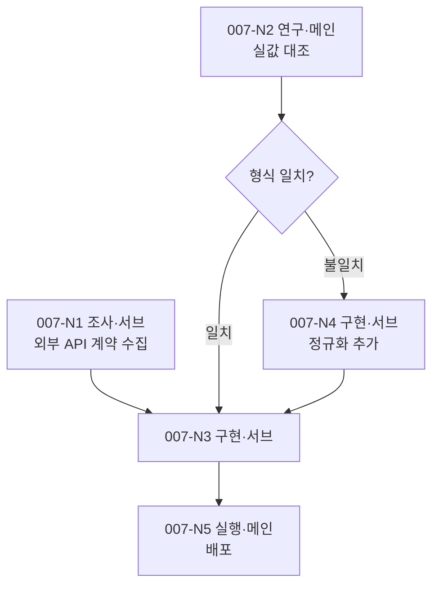

# /dev

여러 `/clear` 세션에 걸치는 개발을 지휘한다. 계획 세션에서 작업을 **노드 흐름도**로 배치하고, 노드 단위로 실행·위임한다.

## 핵심 개념

- **노드 = 작업 단위.** 종류·주체·선행·분기조건·상태를 가진다.
- **세션 = 대화 단위.** 본 스킬은 세션을 스스로 열지 않는다. 한 `/dev` 호출은 실행 가능한 노드를 처리하고 '세션 경계 규칙'에 따라 정지·인수인계한다.
- **DEV_PLAN = 인수인계 장부.** 흐름도(mermaid)와 노드 표를 함께 싣는다. 실행 판단은 **노드 표**로 하고, 흐름도는 사람이 보는 그림이다.
- **컨텍스트 예산은 세션에 쌓인 입력 토큰의 절대량으로 관리한다** — Phase 2 노드 경계와 Phase 3 묶음 경계 두 곳에서 잰다("컨텍스트 임계 판정").
- **인수인계는 세션 끝에 몰아 쓰지 않는다** — 위임 직전·회수 직후·결정 시점 셋에서 DEV_PLAN에 적립하고 각각 커밋한다("인수인계 상시 적립").

## 산출 위치

- 개발 계획서: `<프로젝트 루트>/docs/dev/plan/DEV_PLAN-NNN-<slug>.md`
- 노드 결과(서브 위임분): `<프로젝트 루트>/docs/dev/plan/nodes/<노드ID>.md`
- 사전 조사: `<프로젝트 루트>/docs/dev/research/<slug>.md`
- 후속 항목 대장: `<프로젝트 루트>/docs/dev/plan/FOLLOWUP.md`
- 프로젝트 루트: `git rev-parse --git-common-dir`의 부모. 비-git이면 cwd. `<slug>`는 영문 소문자 kebab-case.

## 노드 ID 규약

노드 ID는 **`NNN-N<번호>`** 형식이다 — `NNN`은 그 노드가 속한 계획서 번호(예: `007-N1`·`007-N2`). 영숫자와 `.`·`_`·`-`만 32자 이내로 쓴다.

노드 결과 문서·브랜치(`node/007-n1`)·워크트리(`<저장소>-nodes/007-n1`)·러너 우편함 이름이 **전부 이 ID에서 파생된다.** 계획서 번호를 빼면 한 저장소에 계획서가 둘 이상 쌓이는 순간 결과 문서가 조용히 덮이고, 남아 있던 동명 브랜치에 새 노드가 이어붙어 앞 계획서의 커밋을 물고 시작한다.

> **Do:** 노드를 추가할 때마다 그 계획서 번호를 앞에 단다
> **Don't:** 이미 진행 중인 계획서의 노드 ID를 소급 개명한다 — 이미 쓰인 결과 문서·브랜치와 어긋난다. 그 계획서에 노드를 더할 때는 그 계획서가 쓰던 형식을 그대로 따른다

## 노드 종류

| 종류 | 기본 주체 | 실행 방법 |
|------|----------|----------|
| 조사 | 서브 | 자료 수집·정리. `researcher`(좁히기 필요) 또는 `Explore`·`general-purpose` |
| 연구 | 메인 | 직접 돌려 결론을 얻는다. 결과가 분기를 만든다 |
| 설계 | 메인 | `/adr` |
| 디자인 | 사용자 | 시안은 사용자가 확정하고 **메인이 구현용 사양서로 정규화한다.** 구현 노드는 시안이 아니라 사양서를 입력으로 받는다 |
| 구현 | 서브 | `/impl` |
| 실행 | 메인 | 1회성 조작 — 병렬 노드 합류(가역), 데이터 보충·이관·배포(비가역). 비가역이면 백업·복구 경로 확인이 통과 조건이고, 무인 진행 중이면 주체를 사용자로 되돌린다(`/dev-loop`의 "비가역 조작 경계") |

**조사와 연구는 실험 포함 여부로 가른다.** 자료를 모아 정리하면 조사, 직접 돌려 봐야 결론이 나면 연구.

**배포는 실행 종류의 끝단 사례다.** 직전 구현 노드가 회귀를 마쳤으므로 테스트 스위트를 다시 돌리지 않는다.

## 주체 판정

노드 종류 표의 `기본 주체`를 쓰되, 아래에 걸리면 그것으로 덮어쓴다(위에서부터 먼저 걸리는 것).

1. 사람만 할 수 있다(육안 대조·실환경 확인·시안 선택) → **사용자**
2. 다른 프로젝트·타인이 해야 한다 → **외부**
3. 사용자에게 선택지를 물어야 하거나, 서브를 스폰해 판단·종합해야 한다 → **메인**

## 위임 실행 모드

`--resume`으로 호출됐고 args에 처리할 노드 ID와 DEV_PLAN 갱신 금지가 **함께** 명시됐으면 위임 실행이다. 회신할 호출자 주소가 확보되지 않으면 위임 실행으로 보지 않고 평소 진입 분기를 따른다 — 대화 중 비슷한 표현이 나왔다고 전환하면 없는 호출자에게 묻다 멈춘다. 아래를 적용하고, 그 외 절차는 평소대로 따른다.

- **DEV_PLAN을 갱신하지 않는다** — 노드 표·흐름도뿐 아니라 frontmatter `status`·후속·유보 섹션도 건드리지 않는다. 결과·계획 변경 제안·발견한 후속·유보 항목은 모두 `nodes/<노드ID>.md`에 적고, DEV_PLAN 반영은 호출자에게 맡긴다.
- **지정된 노드 1개만 처리하고 정지한다.** '세션 경계 규칙'의 연속 처리 판정과 `/clear` 재개 안내를 적용하지 않는다.
- **사용자에게 직접 묻지 않는다.** 결정·확인이 필요하면 위임 메시지의 발신자 주소로 `SendMessage` 회신해 묻고 답을 기다린다 — 화면 출력은 아무에게도 도달하지 않는다.
- **되돌릴 수 없는 조작은 수행하지 않는다.** 배포·데이터 이관·브랜치 합치기가 필요하면 실행하지 말고 호출자에게 반환한다.

> **Do:** 노드 표·흐름도·`status` 필드는 그대로 두고 `nodes/<노드ID>.md`에만 쓴다
> **Don't:** Phase 2 8·9번의 상태 갱신·`status: done` 전환을 위임 모드에서도 실행한다

### 단일 노드 실행

**같은 세션 안에서 Skill로 호출됐고 args에 처리할 노드 ID 1개 제한이 명시됐으면 단일 노드 실행이다.** 위임 실행 모드와 달리 **호출자 주소도 갱신 금지도 없다** — 상위 루프(`/dev-loop`의 지휘 등)가 이미 노드를 골라 놓고 그 하나의 절차만 빌려 쓰는 경우다.

- **지정된 노드 1개만 처리한다.** Phase 2의 1~4번(재진입 처리·노드 선정·분기 정리·보고)을 다시 하지 않는다 — 호출자가 이미 했다. 7번(종류별 실행)부터 시작한다.
- **노드 표의 그 노드 행만 갱신한다.** 다른 노드의 상태, 흐름도, 후속·유보, `status: done` 전환은 건드리지 않는다 — 그 판단은 호출자 몫이다.
- **처리 후 정지한다.** '세션 경계 규칙'의 연속 처리 판정과 `/clear` 재개 안내를 적용하지 않고 호출자에게 반환한다.
- **사용자에게 물어야 하면 호출자의 통로를 쓴다.** 화면 출력이 사람에게 닿지 않는 무인 세션이면 호출자가 지정한 방식(`/dev-loop`의 "사용자에게 닿는 통로")을 따른다.

> **Do:** 호출자가 고른 노드 하나만 돌리고 그 행만 갱신한 뒤 돌려준다
> **Don't:** 준비된 다른 노드까지 이어서 처리하거나, `status: done`을 스스로 전환한다

## 진입 분기 (매 호출, 메인 직접)

1. '위임 실행 모드' 또는 '단일 노드 실행' 조건에 해당하면 → 그 절의 규칙을 얹고 Phase 2 7번(종류별 실행)으로 곧장 간다. 아래 2~5번을 적용하지 않는다.
2. `--followup`이 있거나 사용자가 밀린 후속 작업 처리를 요청하면 → **후속 소진(Phase 3)**. 아래 3~5번을 적용하지 않는다.
3. `--resume <경로>`가 있으면 그 계획서를 사용한다. 없으면 `docs/dev/plan/`을 스캔한다.
4. `status: in-progress` 계획서가 있으면 → **재진입(Phase 2)**. 2개 이상이면 제목을 1줄씩 보여주고 어느 것을 이어갈지 질문 후 답 대기.
5. 없으면 → **신규(Phase 1)**.

## Phase 1 — 계획 세션 (신규)

1. **대화형 인테이크.** 사용자와 구현 범위·제약을 확정한다. 모호한 점만 질문하고 명확하면 넘어간다.
2. **발견 우선 배치.** 외부 계약·실측치·전제 검증을 각각 조사·연구 노드로 세워 **입력이 갖춰지는 가장 이른 지점**에 놓는다. 구현 노드의 선행 확인 항목으로 묻지 않는다.
3. **성공 조건 (선택).** 사용자가 언급했을 때만 대화로 확정해 기록한다.
4. **ADR 필요 판정.** 저장소·데이터 모델·API 계약·인증 경계·주요 라이브러리·모듈 경계를 신규 도입·변경하면 설계 노드를 넣는다. 기존 구조 내 확장·리팩토링뿐이면 생략.
5. **노드 배치.** 먼저 계획서 번호 NNN을 확정한다 — `docs/dev/plan/` 내 최대 번호 +1(3자리, 없으면 001). 노드 ID가 이 번호를 앞에 달기 때문에 배치보다 먼저 정해야 한다("노드 ID 규약"). 이어서 "병렬 배치 규칙"·"분기 배치 규칙"을 적용해 흐름도와 노드 표를 만든다.
6. **DEV_PLAN 작성.** "DEV_PLAN 표준 구조"로 Write한다. 파일명의 NNN은 5번에서 확정한 번호, status는 `in-progress`.
7. **세션 경계 판단** ("세션 경계 규칙").

## 병렬 배치 규칙

- **조사·연구 노드는 선행이 같으면 병렬이 기본이다.** 읽기 전용이라 서로 밟지 않는다.
- **구현 노드를 병렬로 놓으려면 아래 둘을 모두 만족해야 한다.** 하나라도 못 보이면 직렬로 둔다.
  1. 각 노드가 건드릴 파일 집합을 노드 표에 이름으로 적고 교집합이 비어 있다.
  2. 각 노드의 **단위·통합** 테스트가 고정 포트·공유 DB 파일·외부 서비스를 동시에 잡지 않는다. e2e는 합류 노드로 미루므로 병렬 배제 사유가 아니다.
- **검증 노드를 따로 두지 않는다** — 구현 노드가 `/impl` 내부에서 단위·통합을 거치고, e2e는 합류 노드가 담당한다.

> **Do:** 파일 집합을 못 적거나 단위·통합 테스트 자원이 겹치는 구현 노드 2개는 직렬로 잇는다
> **Don't:** 기능이 달라 보인다는 이유로 병렬 배치하거나, 구현 노드 뒤에 별도 검증 노드를 단다

### 병렬 구현 노드의 격리와 합류

구현 노드를 **병렬로 실행할 때만** 적용한다. 단독 실행이면 워크트리를 만들지 않고 메인 워킹트리에서 `/impl`을 그대로(e2e 포함) 돌린다.

1. 메인이 노드마다 워크트리를 만든다 — `git worktree add <경로> -b node/<노드ID>`.
2. 그 워크트리를 작업 위치로 `/impl`을 실행하고, 위임에 **"evaluator·e2e는 상위 합류 노드에서 수행한다. 통합 code-reviewer 통과 시점에 종료하라"** 를 명시한다. 나머지 단계(계획·단위·리뷰·트랙 머지·통합)는 노드 워크트리 안에서 평소대로 닫힌다.
3. 노드가 끝나면 `node/<노드ID>` 브랜치에 커밋만 남는다.
4. **합류 노드**(종류=실행, 주체=메인, 선행=병합 대상 구현 노드 전체)에서 메인이 순서대로 처리한다.
   1. 노드 브랜치를 하나씩 머지한다. 충돌하면 멈추고 사용자에 보고하며, 해소 후 **그 노드 머지부터** 재개한다.
   2. 전체 테스트 스위트를 1회 돌린다.
   3. `evaluator` 스폰 — 위임에 **노드별 워크스페이스 경로 목록**(각 `03_plan.md`의 E2E 골격을 Read하도록)과 DEV_PLAN의 성공 조건을 전달한다. 산출 경로를 e2e 에이전트에 넘겨 스폰한다(에이전트 선택은 `/impl` 7단계 규약과 동일). e2e가 없는 프로젝트면 3·4를 생략.
   4. e2e 실패 시 실패 시나리오가 닿는 파일을 노드 표의 `담당 파일`과 대조해 원인 노드를 지목하고, 그 노드를 `실패`로 되돌려 재실행한다. **대조로 특정되지 않으면 합류 노드를 `실패`로 두고 사용자에 보고한다** — 임의로 지목하지 않는다.

노드 결과 파일은 **그 노드 워크트리 안의** `docs/dev/plan/nodes/<노드ID>.md`에 쓴다. 메인은 절대경로로 읽고, 머지 시 함께 들어온다.

> **Do:** 병렬 노드는 통합 리뷰까지, e2e는 합쳐진 트리에서 한 번만 돌린다
> **Don't:** 병렬 노드가 각자 e2e를 돌리게 하거나, 서브·러너에게 메인 워킹트리로의 머지를 시킨다

## 분기 배치 규칙

- **분기 자체는 노드가 아니다.** 흐름도에는 마름모로 그리되 노드 표에 행을 만들지 않는다. 갈래마다 후속 노드를 두고, 그 노드의 `선행`에 판정할 연구 노드를, `조건` 칸에 갈래를 적는다.
- 갈래를 예상할 수 없으면 **재계획 노드**(종류=연구, 주체=메인) 하나만 두고, 결과가 나온 뒤 메인이 흐름도와 표를 확장한다.
- 갈래가 확정되면 선택되지 않은 쪽 노드의 상태를 **건너뜀**으로 바꾼다. 그대로 두면 계획이 완료 판정을 받지 못한다.

## Phase 2 — 노드 실행 (재진입)

1. DEV_PLAN을 Read한다. **상태가 `진행`인 노드가 있으면 아래 "미회수 노드 재진입 분기"를 먼저 처리한다** — 앞 세션이 보내 놓고 회수하지 못한 노드가 여기 걸린다.
2. **선행이 모두 완료·건너뜀이면서 상태가 대기**인 노드를 모두 찾는다.
3. **분기 정리.** 그중 `조건` 칸이 채워진 노드는 선행 노드의 결과로 조건을 판정한다. 충족한 것만 실행 대상으로 남기고, 나머지 갈래는 상태를 `건너뜀`으로 바꾼다.
4. 사용자에 1줄 보고 후 진행 ("실행 가능: 007-N4 구현·서브, 007-N6 조사·서브. 병렬로 진행합니다").
5. **위임 직전 검사·적립.** 노드를 하나라도 시작하기 전에 순서대로 둘을 한다.
   1. **"컨텍스트 임계 판정"** — 약한 임계를 넘었으면 이 노드를 시작하지 않고 10번(세션 경계 판단)의 정지 절차로 간다.
   2. **위임 시점 기록** — 시작할 노드의 상태를 `진행`으로 바꾸고 위임처(서브 스폰이면 그 사실, tmux 위임이면 세션명)와 워크트리 경로를 노드 표에 적은 뒤 곧바로 커밋한다("인수인계 상시 적립" 1번). **기록이 위임에 선행한다** — 위임하고 나서 적으면 그 사이에 세션이 끊길 때 위임처를 아무도 모른다.
6. 주체별 처리:
   - **서브 노드가 여럿** → 한 응답에 묶어 병렬 스폰 ("서브 노드 위임 규칙").
   - **메인 노드** → 하나씩 처리한다.
   - **사용자·외부 노드** → 필요한 것을 안내하고 상태를 `진행`으로 두되 **위임처 칸은 비워 둔다**("미회수 노드 재진입 분기" 1번이 이것으로 사람 대기 노드를 가른다). 다른 실행 가능 노드로 넘어가고, 그것만 남으면 정지·안내.
7. 종류별 실행:
   - **설계** → `/adr`을 Skill로 호출. 결정 문제·배경·후보안·(있으면) 조사 노드 산출 경로를 전달. 산출 ADR 경로를 `## 아키텍처 결정`에 기록.
   - **구현** → `/impl`을 Skill로 호출. 전달: ① 구현 범위 ② (있으면) 확정 ADR 경로 — `/impl`이 설계 단계를 생략하고 채택한다 ③ (있으면) 그 노드에 배분된 성공 조건 원문. 중단된 노드면(노드 표에 워크스페이스 경로 기록) `/impl --resume <경로>`로 이어간다. 반환된 워크스페이스 절대경로를 노드 표에 기록. **병렬 배치된 노드면 "병렬 구현 노드의 격리와 합류"를 따른다.**
   - **실행** → 되돌릴 수 없는 조작이면 백업·복구 경로를 먼저 확인한다. 확인되지 않으면 사용자에 보고하고 대기. **합류 노드면 "병렬 구현 노드의 격리와 합류" 4번을 따른다.**
8. **회수·갱신.** 서브 노드면 `nodes/<노드ID>.md`를 Read해 `## 계획 변경 제안` 절이 있는지 확인한다. **병렬 노드는 그 노드 워크트리의 절대경로로 읽는다.** 제안과 발견된 후속·유보 항목은 아래 "반영·보고 선택 기준"으로 가른다. 이어서 노드 상태와 판정 근거를 적고 커밋한다("인수인계 상시 적립" 2번).
9. **후속·유보 처리** ("후속·유보 작업"). 전 노드가 완료·건너뜀이면 `status: done`으로 바꾸고, 후속 작업에 `[ ]` 항목이 남아 있으면 완료 보고에 함께 출력하며 `/dev --followup`으로 소진할 수 있음을 1줄 안내한다.
10. **세션 경계 판단** ("세션 경계 규칙").

### 반영·보고 선택 기준

회수한 제안·발견 항목을 **DEV_PLAN에 반영**할지 **사용자에 1줄 보고**만 할지는 아래로 가른다.

- **반영** — 계획 구조를 바꾸는 것. 노드 추가·삭제·분할, 선행·조건·주체·담당 파일 변경, 흐름도 변경, 후속·유보 섹션에 남길 항목, 뒤 노드의 전제를 뒤집는 실측.
- **보고** — 그 노드 안에서 닫힌 것. 이미 반영돼 있는 내용의 재확인, 산출물 안에 이미 적힌 구현 세부, 다음 노드가 노드 파일을 읽으면 알게 되는 참고사항.
- **가르기 애매하면 반영한다.** 계획서에 적혀야 다음 세션이 본다 — 보고는 이 세션이 끝나면 사라진다.

> **Do:** 계획 구조를 건드리는 제안은 계획서에 적고 커밋한다
> **Don't:** 반영할 것을 보고로 갈음하거나, 노드 안에서 닫힌 세부까지 계획서에 옮겨 적는다

### 미회수 노드 재진입 분기

노드 표에서 상태가 `진행`인 노드를 만나면, 새 노드를 시작하기 전에 노드마다 아래를 수행한다.

1. **위임처 칸을 먼저 본다.** 비어 있으면 **사람을 기다리는 노드다**(주체가 사용자·외부이거나 안내만 하고 넘긴 노드). 재위임 대상이 아니므로 안내가 이미 나갔는지 확인하고, 안 나갔으면 다시 안내한 뒤 그대로 `진행`에 두고 다음 노드로 넘어간다. 위임처가 적혀 있으면 2번으로 간다.
2. 적힌 tmux 세션명으로 `tmux has-session -t <세션명>`을 확인한다. 위임처가 서브에이전트로 적혀 있으면(같은 세션 안의 스폰) 그 세션은 이미 사라진 것이므로 4번으로 간다.
3. **살아 있으면 회수부터** — 진행 보고 요청을 보내고(변별자 규칙은 `/dev-loop`의 "회신 변별자") 응답과 산출을 회수한 뒤 Phase 2 8번(회수·갱신)으로 합류한다. 새 노드를 먼저 시작하지 않는다.
4. **죽었으면 워크트리와 브랜치를 본다** — `node/<노드ID>` 브랜치에 커밋이 있거나 `nodes/<노드ID>.md`가 있으면 그것을 산출로 보고 회수·검증부터 재개한다. 둘 다 없으면 같은 워크트리를 재사용해 재위임한다(워크트리도 없으면 새로 만든다).

> **Do:** 위임처 유무로 먼저 갈라 사람 대기 노드를 재위임 경로에서 빼고, 살아 있는 위임처는 회수를 새 위임보다 앞에 둔다
> **Don't:** 위임처가 비었다고 죽은 작업 노드로 보아 재위임하거나, `진행` 표시를 무시하고 같은 노드를 두 번 위임한다

## 서브 노드 위임 규칙

- 위임 프롬프트에 **노드 ID·작업 범위·산출 경로·(구현이면) 담당 파일 집합**만 준다. DEV_PLAN 본문을 발췌해 넣지 않고 경로 Read를 지시한다.
- 서브는 **노드 실행 결과와 계획 변경 제안**을 `docs/dev/plan/nodes/<노드ID>.md`에 쓴다. 하위 스킬(`/impl`·`/adr`)의 고유 산출물은 그 스킬 규약의 경로를 따른다.
- **DEV_PLAN은 읽기만 한다.** 계획을 바꿔야 한다고 판단하면 노드 파일의 `## 계획 변경 제안` 절에 사유를 적고 보고만 한다.

> **Do:** 서브는 자기 노드 파일만 쓰고, 계획 변경은 제안으로 올린다
> **Don't:** 서브가 DEV_PLAN의 노드 표·흐름도를 직접 고치거나, 위임 범위 밖 노드의 결과를 적는다

## 세션 경계 규칙

- **무게 판정은 메인이 직접 실행한 노드에만 적용한다.** 서브 노드는 요약만 회수하므로 무게에 세지 않는다.
  - **무거움**: 연구 노드 / 실행 노드 / 디자인 노드 / 메인 직접 작성 경로의 설계 노드 / 대화 인테이크 왕복 5회 이상
  - **가벼움**: 서브 노드 회수 / synthesizer 경유 설계 노드 / 왕복 4회 이하 대화
- 정지·계속 판단은 방금 끝낸 노드의 **실제 진행**으로 한다.
- 한 노드를 마칠 때마다:
  - 방금 마친 것이 무거움 → **정지**. 계획서 갱신 + "`/clear` 후 `/dev`로 이어가세요" 안내.
  - 방금 마친 것이 가벼움 + 다음 실행 가능 노드도 가벼움 → Phase 2 1번으로 돌아가 이어 실행.
  - 다음 실행 가능 노드가 무거움 → 정지·안내. 실행 가능 노드 없음 → 대기 중인 사용자·외부 노드를 안내하거나 완료 보고.
- **세션 종료 커밋.** 정지·완료로 세션을 끝내기 직전, 작업 트리에 미커밋 변경이 있으면 커밋한다 — 태그는 생성하지 않는다(전역 커밋·태그 규칙의 사이클 태깅을 `/dev` 세션 종료 커밋과 "인수인계 상시 적립"의 적립 커밋에 한해 면제). "인수인계 상시 적립"을 지켰으면 여기서 새로 쓸 것은 거의 없다 — 남은 미커밋 변경만 담는다. 없으면 생략.

> **Do:** 무거운 노드 하나로 그 세션을 끝내고, 미커밋 변경은 커밋만 남긴다
> **Don't:** 한 호출에서 무거운 노드 2개를 연달아 처리하거나, 태그를 붙이거나, 커밋 없이 다음 세션으로 넘긴다

## 컨텍스트 임계 판정

세션에 쌓인 **입력 토큰 절대량**으로 판정한다. 창은 100만이지만 왕복 비용과 판단 품질 때문에 20~30만에서 끊는 것이 목표다.

**자기 상태 파일 지목.** 1차 수단은 이 세션의 스크래치패드 경로에 박힌 UUID이고, 보조가 `CLAUDE_CODE_SESSION_ID` 환경 변수다. **같은 디렉토리에서 수정 시각이 가장 최신인 파일을 자기 것으로 삼지 않는다** — 거기에는 수십 개 세션의 파일이 함께 쌓여 남의 포화도를 자기 것으로 읽는다.

```bash
jq -r '.context_window.total_input_tokens' ~/.claude/status/<자기 세션 UUID>.json
```

| 임계 | 값 | 행동 |
|---|---:|---|
| 약함 | **200,000토큰** | 새 작업 단위를 시작하지 않는다. 이미 시작한 것은 끝까지 회수·갱신한 뒤 정지·인수인계 |
| 강함 | **300,000토큰** | 진행 중인 것을 두고 나간다. 진행 상태 한 줄만 적립하고 즉시 정지 |

- **절대 토큰으로 적고 퍼센트를 쓰지 않는다.** 퍼센트 필드(`used_percentage`)는 1%가 1만 토큰이라 해상도가 모자란다.
- **검사 자리는 작업 단위 경계다** — Phase 2는 노드 위임 직전(두 값 다), Phase 3은 묶음 시작 직전(약한 임계). 완료 직후와 다음 시작 직전은 같은 시점이므로 두 번 재지 않고, 작업 단위가 도는 중에는 재지 않는다.
- **판정은 숫자 비교다. LLM 판단이 아니다.** 방금 사이클 하나의 체감으로 일반화하지 않는다.
- **강한 임계는 정상 경로에서 울리지 않는다.** 울렸으면 DEV_PLAN에 한 줄 남긴다 — 약한 임계의 전제가 깨졌다는 재조정 신호다.
- **계측 실패의 처분은 세션 성격으로 갈린다.** 상태 파일을 못 읽으면 어느 쪽이든 2초 후 1회 재시도한다.
  - **사용자 대면 세션** — 재시도도 실패하면 임계 판정을 건너뛰고 '세션 경계 규칙'의 무게 판정만 쓴다. 옆에 사람이 있으므로 포화는 사람이 잡는다.
  - **무인 세션**(`/dev-loop`의 지휘 세션 등 사용자가 화면을 보지 않는 세션) — 작업 단위 경계에서 **연속 2회 실패하면 약한 임계 도달로 간주**한다. 새 작업 단위를 시작하지 않고 계측 불능을 호출자에 보고한 뒤 정지·인수인계로 간다. 계측이 죽은 채 무한히 도는 것은 금지다.

## 인수인계 상시 적립

인수인계를 세션 끝에 몰아 쓰지 않는다. **DEV_PLAN을 상시 적립해 어느 순간 끊겨도 최신이게 한다.** 적는 시점은 셋이고 **각각 커밋한다.**

| 시점 | 적는 것 |
|---|---|
| 1. **위임 직전** | 노드 상태를 `진행`으로 + 위임처(tmux 세션명) + 워크트리 경로 ("미회수 노드 재진입 분기"의 입력) |
| 2. **회수 직후** | 결과와 판정 근거. 분기 노드면 고른 갈래와 그 이유 |
| 3. **결정이 오갈 때마다** | 사용자·호출자와 정한 것을 한 줄 |

이렇게 하면 포화로 세션이 끊길 때 새로 쓸 인수인계가 남지 않는다 — 임계의 차이가 "인수인계를 쓰느냐"가 아니라 **"진행 중인 것을 회수하고 나가느냐 두고 나가느냐"**가 된다.

- **적립 커밋에는 태그를 붙이지 않는다.** 볼트처럼 "모든 커밋에 태그"를 요구하는 저장소에서도 중간 과정 커밋은 면제한다(2026-08-22 사용자 승인).
- **경로를 지정해 커밋한다** — `git add <DEV_PLAN 경로> <nodes/…>`. **`git add -A`·`git add -u`는 쓰지 않는다** — 같은 저장소에서 도는 동기화 잡이나 다른 세션의 변경을 함께 실어 보낸다.
- **쓰기와 커밋 사이를 벌리지 않는다.** 갱신은 임시 파일에 쓴 뒤 rename하는 원자 쓰기로 하고 곧바로 커밋한다. 반쯤 쓰인 파일이 남의 스테이징에 실려 가는 창을 줄인다.
- **커밋 SHA를 참조로 저장하지 않는다** — 동기화 잡의 `pull --rebase`가 커밋을 다시 쓴다. 노드 표의 `산출` 칸에는 경로·브랜치명을 적는다.
- **push·pull은 하지 않는다.** 커밋이 `index.lock` 경합으로 실패하면 2초 후 1회 재시도하고, 재실패하면 다음 적립 시점에 합쳐 커밋한다(파일은 이미 써 있다).

> **Do:** 위임 직전·회수 직후·결정 시점마다 경로를 지정해 태그 없이 커밋한다
> **Don't:** 인수인계를 세션 끝에 몰아 쓰거나, `git add -A`로 담거나, SHA를 계획서에 적어 둔다

## 후속·유보 작업

노드 실행 중 작업이 식별되면 DEV_PLAN의 전용 섹션에 성격별로 나눠 append한다.

- **후속 작업** — 해야 하지만 이번 계획서 범위 밖으로 미루는 작업. 계획 완료를 막지 않는다.
- **유보 작업** — 중요도가 낮고 현재 사용자 경험에 영향이 없으나 개선 여지가 있는 항목(코드 리뷰 minor 등급 상당).

노드 진행 자체는 노드 표에만 기록·갱신한다.

> **Do:** "해야 하는데 이번엔 안 함"은 후속, "안 해도 되지만 하면 나아짐"은 유보로 나눠 적는다
> **Don't:** 후속·유보를 한 목록에 섞거나 노드 표에 끼워 넣거나, 계획서 밖 파일에 기록한다

## Phase 3 — 후속 소진 (`--followup`)

계획서에 쌓인 후속·유보 항목을 수확해 묶음 단위로 소진한다. 대상은 `status`와 무관하게 그 프로젝트의 계획서 전부다. 프로젝트를 가로지르지 않는다 — 한 호출은 현재 프로젝트 루트만 다룬다.

`FOLLOWUP.md`가 이미 있으면 수확을 건너뛰고 묶음 표에서 상태가 `대기`·`진행`인 첫 묶음부터 잇는다. 단 대장의 수확일이 7일 이상 지났으면 다시 수확할지 질문 후 답 대기. 재수확하면 **항목 원문으로 대조**해 일치하는 것만 이전 대장의 `보류(미승인)` 표시를 옮겨 적고, 대조되지 않으면 새 항목으로 보아 다시 승인을 묻는다.

### 1. 수확 (서브 1개, 프로젝트 단위)

`docs/dev/plan/`의 계획서 전수를 조사 에이전트 **하나**에 맡긴다. 계획서별로 쪼개지 않는다 — 계획서 간 사본·상태 불일치는 전체를 함께 봐야 잡힌다.

위임 프롬프트에 넣을 것:

- **수집 범위** — `## 후속`·`## 유보`로 시작하는 모든 섹션. 제목 표기가 계획서마다 다르고, 체크박스 없이 서술형 불릿으로만 적힌 계획서도 있다.
- **항목별 판정 4종** — ① **유효성**: 코드·커밋과 대조해 이미 반영됐거나 폐기됐는지 ② **성격**: 기능 추가 / 기능 외 코드 수정 / 결정 대기 / 수동 검증 / 배포·운영 / 문서 / 조사 ③ **착지 파일**: 항목에 없으면 코드에서 찾아 보완 ④ **의존**: 선행 항목과 같은 파일·화면을 건드리는 항목.
- **기능 추가 판정 기준** — 사용자에게 보이는 동작·화면·명령·옵션·설정이 새로 생기거나, 의존성·외부 연동·저장 대상이 늘면 **기능 추가**. 기존 동작을 명세대로 되돌리는 수정이거나 겉동작이 그대로인 개선·리팩터링이면 **기능 외**. 판정이 갈리면 기능 추가로 적는다.
- **계획서 간 불일치** — 같은 항목의 사본, 한쪽만 닫힌 항목, 한쪽만 갱신된 근거.

산출은 `docs/dev/plan/FOLLOWUP.md`에 항목 대장으로 쓴다. 수확일과 항목별 출처 계획서·줄 번호를 단다.

> **Do:** 체크박스 상태가 아니라 코드 대조로 유효성을 판정하게 한다
> **Don't:** `- [ ]`를 grep해 목록을 만든다 — 형식이 다른 계획서와 유보 섹션이 통째로 빠지고, 이미 끝난 항목이 살아 있는 채로 들어온다

### 2. 정리 게이트 (메인 직접)

1. **무효·사본** — 이미 반영·폐기된 항목과 중복 사본을 1줄씩 보여주고 승인받아 출처 계획서의 항목을 닫는다.
2. **코드 아닌 항목** — 결정 대기·수동 검증·배포·운영·문서·조사 항목을 성격별 목록으로 출력하고 대장에 `보류`로 표시한다. `/impl`에 넘기지 않는다.
3. **신규 기능 승인** — 성격이 `기능 추가`인 항목을 한 줄씩(요지 · 착지 파일 · 출처 계획서) 보여주고 **항목 단위로 승인 질문 후 답을 기다린다.** 승인분만 대장 상태를 `대기`로 두고, 나머지는 `보류(미승인)`로 적으며 출처 계획서의 항목은 열린 채로 둔다. 같은 출력에 `기능 외`로 분류된 항목도 요지만 한 줄씩 붙여 오분류를 사용자가 걸러낼 수 있게 한다.
4. 승인된 기능 추가 항목과 기능 외 코드 수정 항목만 "묶음 편성"의 대상이다.

> **Do:** 기능 추가는 항목별로 물어 승인된 것만 편성에 넘긴다
> **Don't:** 결함 수정과 한데 묶어 일괄 승인받거나, 답을 기다리지 않고 편성·실행으로 넘어간다

### 3. 묶음 편성 (메인 직접)

1. **클러스터** — 같은 파일·모듈·화면을 건드리는 항목끼리 묶는다. 성격이 다른 항목은 한 묶음에 섞지 않는다. 기능 추가와 기능 외 항목은 착지 파일이 같아도 묶음을 나눈다.
2. **크기** — 묶음을 `/impl` 크기 기준에 태워 파일 10개를 넘으면 쪼갠다. 클러스터에 안 붙는 고아 항목은 성격이 같은 것끼리 최대 5건까지 합친다.
3. **순서** — 시한 명시 > 다른 항목·계획서를 차단 > 결함 > 개선. 동률이면 계획서 번호 순.

편성 결과를 대장에 묶음 표(`묶음ID | 구분(기능/기능외) | 항목 | 착지 파일 | 출처 계획서 | 상태(대기/진행/완료/실패/보류(미승인))`)로 적고 사용자에 묶음 수와 첫 묶음만 1줄 보고한다.

### 4. 실행·갱신

**첫 묶음을 시작하기 전에 '컨텍스트 임계 판정'을 본다.** 수확·정리 게이트만으로 임계를 넘겼으면 묶음을 하나도 시작하지 않고 아래 정지 절차로 간다.

묶음 하나를 `/impl`에 위임한다 — 전달: 묶음 항목 원문 · 착지 파일 · 출처 계획서 경로 · **승인 범위**(묶음 항목 밖의 기능 추가는 구현하지 말고 후속 작업으로 되돌려 보고하라고 명시). 반환 후 출처 계획서의 해당 항목을 닫고 대장의 묶음 상태를 갱신한다. `/impl`이 돌려보낸 기능 추가는 대장에 `보류(미승인)`로 추가하고, 위임이 실패·롤백됐으면 묶음 상태를 `실패`로 둔다.

묶음을 마칠 때마다 아래 둘을 보고 **하나라도 걸리면 정지**한다.

- **컨텍스트 임계 판정** — 200,000토큰 초과.
- **묶음 무게** — `/impl`이 크기 중·대로 처리했으면 무거움, 소면 가벼움.

**판정은 방금 마친 묶음만 본다.** 다음 묶음의 무게는 `/impl`이 돌기 전에는 확정되지 않으므로 '세션 경계 규칙'의 다음 실행 단위 선판정은 Phase 3에 적용하지 않는다. 정지할 때는 직전 반환에서 이미 갱신해 둔 출처 계획서·대장을 커밋하고 "새 세션에서 `/dev --followup`으로 이어가세요"를 안내한다. **대장의 묶음 표가 곧 인수인계이므로 별도 인수인계 문서를 쓰지 않는다.**

> **Do:** 묶음을 마칠 때마다 출처 계획서와 대장을 함께 갱신한다
> **Don't:** 여러 묶음을 처리한 뒤 갱신을 몰아서 한다 — 중간에 정지하면 어디까지 닫혔는지 알 수 없다

## 조사·연구 노드 판정

아래 중 하나라도 해당하면 코드 작성 전에 노드를 세운다.

- 학습 컷오프(2026-01) 이후 빠르게 바뀌는 외부 기술 의존 — 라이브러리·프레임워크 버전, LLM/AI API, 클라우드 서비스 기능, 최근 6개월 내 릴리스·변경된 도구 → **조사**
- 외부 시스템과의 계약(필드명·형식·응답 구조)에 구현이 의존 → **조사**, 실값 대조가 필요하면 **연구**
- 실측·시행 결과에 따라 구현 방향이 갈림 → **연구**
- 사용자가 조사를 명시 요청

해당 없으면(안정적 도메인·내부 로직·리팩토링·정착된 라이브러리) 생략한다. 단순 1줄 사실 조회는 노드로 세우지 않고 `general-purpose`(haiku)로 갈음한다.

> **Do:** 최신 기술·외부 계약은 노드로 세워 구현 앞에 놓는다
> **Don't:** 컷오프 이전 지식이나 문서상 기재만으로 외부 계약을 단정한다

## DEV_PLAN 표준 구조

````markdown
---
title: <제목>
status: in-progress | done
created: YYYY-MM-DD
project: <프로젝트명>
tags: [dev-plan]
---

# DEV_PLAN-NNN: <제목>

## 목표
<무엇을·왜 만드는가>

## 성공 조건          ← 언급 없으면 섹션 생략
- [ ] 1. <사용자 정의 조건>

## 아키텍처 결정
- ADR 필요: 예/아니오
- (예) docs/adr/ADR-NNN-<slug>.md — 예정/작성됨

## 노드 흐름



| ID | 종류 | 주체 | 선행 | 조건 | 담당 파일 | 상태 | 산출 |
|----|------|------|------|------|----------|------|------|
| 007-N1 | 조사 | 서브 | — | — | — | 완료 | nodes/007-N1.md |
| 007-N2 | 연구 | 메인 | — | — | — | 완료 | — |
| 007-N3 | 구현 | 서브 | 007-N1·007-N2 | — | src/api/* | 대기 | — |
| 007-N4 | 구현 | 서브 | 007-N2 | 형식 불일치 | src/norm.py | 건너뜀 | — |
| 007-N5 | 실행 | 메인 | 007-N3 | — | — | 대기 | — |

- 상태: 대기 / 진행 / 완료 / 실패 / 건너뜀
- 노드 ID는 계획서 번호를 앞에 단다("노드 ID 규약"). 흐름도에도 표와 같은 ID를 그대로 쓴다
- 흐름도의 마름모는 표에 행이 없다. 갈래는 후속 노드의 `조건` 칸으로 표현한다
- `담당 파일`은 구현 노드를 병렬 배치할 때만 채운다(교집합 공백 증명용)
- 성공 조건이 있으면 `조건` 칸이 아니라 노드 아래 1줄로 배분을 적는다

## 후속 작업          ← 없으면 섹션 생략
- [ ] <이번 범위 밖으로 미루지만 해야 할 작업>

## 유보 작업          ← 없으면 섹션 생략
- [ ] <개선 여지 — 중요도 낮음·UX 영향 없음>
````

## 주의사항

- 날짜는 현재 세션 컨텍스트의 날짜를 쓴다(추측 금지).
- 조사·설계 산출물 본문은 최소한만 읽고 경로로 참조해 하위 스킬·에이전트에 전달한다.
- 본 스킬은 지휘만 한다. 코드 구현·수정은 `/impl`, 설계 문서는 `/adr`이 수행한다.
