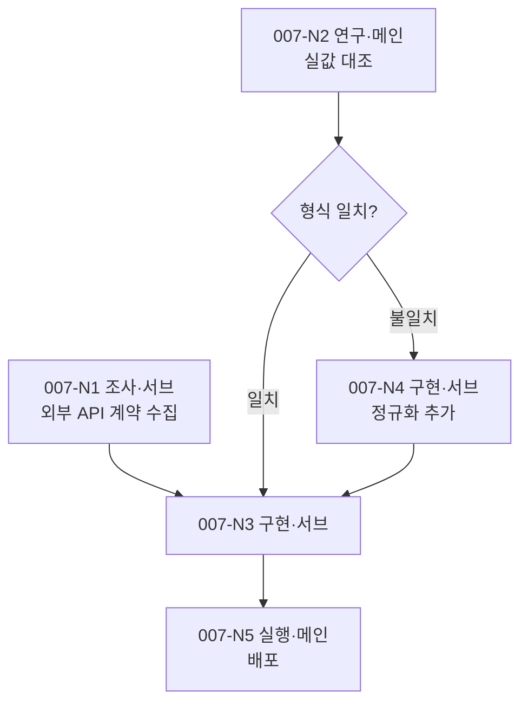

# /dev — 계획 세션

`/dev` Phase 1(신규 계획)에서만 읽는다. 재진입 회차·후속 소진에서는 로드하지 않는다.

## Phase 1 — 계획 세션 (신규)

1. **대화형 인테이크.** 사용자와 구현 범위·제약을 확정한다. 모호한 점만 질문하고 명확하면 넘어간다. "의도 인터뷰" 게이트에 걸리면 이어서 그 절을 수행하되, **여기서 이미 답한 항목은 다시 묻지 않는다.**
2. **정보 출처 판정** ("정보 출처 판정"). 미지수를 출처별로 가르고, 사용자만 닿는 것은 이 자리에서 캐물어 닫는다.
3. **발견 우선 배치.** 외부 계약·실측치·전제 검증을 각각 조사·연구 노드로 세워 **입력이 갖춰지는 가장 이른 지점**에 놓는다. 구현 노드의 선행 확인 항목으로 묻지 않는다.
4. **성공 조건 (선택).** 사용자가 언급했을 때만 대화로 확정해 기록한다. 의도 인터뷰를 수행했으면 그 답변에서 확정한 것을 옮겨 적는다.
5. **ADR 필요 판정.** 저장소·데이터 모델·API 계약·인증 경계·주요 라이브러리·모듈 경계를 신규 도입·변경하면 설계 노드를 넣는다. 기존 구조 내 확장·리팩토링뿐이면 생략.
6. **노드 배치.** 먼저 계획서 번호 NNN을 확정한다 — `docs/dev/plan/` 내 최대 번호 +1(3자리, 없으면 001). 노드 ID가 이 번호를 앞에 달기 때문에 배치보다 먼저 정해야 한다("노드 ID 규약"). 이어서 "병렬 배치 규칙"·"분기 배치 규칙"을 적용해 흐름도와 노드 표를 만든다.
7. **DEV_PLAN 작성.** "DEV_PLAN 표준 구조"로 Write한다. 파일명의 NNN은 6번에서 확정한 번호, status는 `in-progress`.
8. **세션 경계 판단** ("세션 경계 규칙").

## 정보 출처 판정

계획이 참이라고 가정할 미지수를 나열하고, 미지수마다 출처를 표시한다.

| 출처 | 뜻 | 처리 |
|------|----|------|
| ⓐ 클로드가 닿음 | 코드·문서·웹·DB로 확인된다 | 조사 노드 |
| ⓑ 돌려 보면 확인됨 | 실행·실측으로 결론이 난다 | 연구 노드 |
| ⓒ 사용자만 닿음 | 사람이 하는 화면 조작 절차·업무 관행·자격·물리 접근 | **이 자리에서 캐묻는다** |

**ⓒ가 하나라도 있으면 계획서를 쓰기 전에 답을 받아 닫는다.** 라운드 수를 제한하지 않는다.

**캐묻기 완결 기준은 재현 가능성이다.** 첫 화면부터 완결(저장·전송·제출)까지 각 단계에 ①무엇이 보이는가 ②어디를 누르거나 무엇을 입력하는가 ③무엇이 바뀌면 다음으로 가는가, 셋이 다 차야 통과다. 빈 칸이 있으면 그 칸만 다시 묻는다. 답이 `## 조작 절차` 표의 한 줄이 되지 않으면 아직 못 들은 것이다.

사용자가 "모른다"·"확인해야 안다"로 답한 칸은 `미확인 — <확인 방법·주체>`로 적고 다음 미지수로 넘어간다. **`미확인`이 남으면 계획서는 쓰되 그 항목에 걸린 하류는 착수하지 않는다.**

**ⓒ를 ⓑ로 내리지 않는다.** 사람만 아는 절차를 실측 노드로 세우면 회차를 태우고도 "확인하지 못했다"로 닫힌다.

계획을 세운 **뒤에** 새 ⓒ가 드러났을 때의 처리(청취 노드)는 SKILL.md "조사·연구 노드 판정"이 갖는다 — 그 자리는 이 파일을 읽지 않는 회차다.

> **Do:** 화면을 더듬기 전에 "그 창을 어떻게 여시는지" 먼저 여쭙고, 답을 절차 표로 적어 확정받는다
> **Don't:** 사용자만 아는 절차를 실측·시행착오 노드로 세우거나, 부분만 듣고 나머지를 추정으로 메운다

## 의도 인터뷰

**게이트.** 아래 둘 중 하나면 수행하고, 둘 다 아니면(기존 모듈 확장·리팩토링) 건너뛴다. 사용자가 생략을 요청하면 게이트와 무관하게 건너뛴다.

1. 요청에 사용자 대상 또는 성공 기준이 적혀 있지 않다
2. 코드베이스에 그 기능 관련 파일이 없다(신규)

**질문은 2라운드로 끝낸다.** 라운드마다 답을 받기 전에 다음으로 넘어가지 않는다.

- 1라운드 — 누가 겪는 문제인가 / 관찰된 고통은 무엇인가 / 오늘은 왜 해결되지 않는가 / 왜 지금인가 / 해결됐음을 무엇으로 아는가 / 주요 사용자와 그 트리거 / 대상이 아닌 사람 / 제약
- 2라운드 — 최소 단위(MVP) / v1 필수와 후순위 / 핵심 가설 / 안 만들 것 / 접근을 바꿀 수 있는 미해결 질문

시장·경쟁·기술 타당성은 인터뷰에서 묻지 않고 조사·연구 노드로 세운다("조사·연구 노드 판정").

**산출.** 답변을 "DEV_PLAN 표준 구조"의 `## 의도`·`## 사용자 여정` 두 섹션에 적는다. 근거가 없는 항목은 `가정 — <검증 방법> 필요`로 적는다. 여정은 초안을 제시해 사용자 확정을 받은 뒤 확정본만 계획서·구현 노드 위임에 남긴다.

**하류 전달**은 "서브 노드 위임 규칙"을 따른다.

## 병렬 배치 규칙

- **조사·연구 노드는 선행이 같으면 병렬이 기본이다.** 읽기 전용이라 서로 밟지 않는다.
- **구현 노드를 병렬로 놓으려면 아래 둘을 모두 만족해야 한다.** 하나라도 못 보이면 직렬로 둔다.
  1. 각 노드가 건드릴 파일 집합을 노드 표에 이름으로 적고 교집합이 비어 있다.
  2. 각 노드의 **단위·통합** 테스트가 고정 포트·공유 DB 파일·외부 서비스를 동시에 잡지 않는다. e2e는 합류 노드로 미루므로 병렬 배제 사유가 아니다.
- **검증 노드를 따로 두지 않는다** — 구현 노드가 `/impl` 내부에서 단위·통합을 거치고, e2e는 합류 노드가 담당한다.

> **Do:** 파일 집합을 못 적거나 단위·통합 테스트 자원이 겹치는 구현 노드 2개는 직렬로 잇는다
> **Don't:** 기능이 달라 보인다는 이유로 병렬 배치하거나, 구현 노드 뒤에 별도 검증 노드를 단다

병렬로 배치한 노드를 **실행**할 때의 워크트리 격리·합류 절차는 SKILL.md의 "병렬 구현 노드의 격리와 합류"가 갖는다.

## 분기 배치 규칙

- **분기 자체는 노드가 아니다.** 흐름도에는 마름모로 그리되 노드 표에 행을 만들지 않는다. 갈래마다 후속 노드를 두고, 그 노드의 `선행`에 판정할 연구 노드를, `조건` 칸에 갈래를 적는다.
- 갈래를 예상할 수 없으면 **재계획 노드**(종류=연구, 주체=메인) 하나만 두고, 결과가 나온 뒤 메인이 흐름도와 표를 확장한다.
- 갈래가 확정되면 선택되지 않은 쪽 노드의 상태를 **건너뜀**으로 바꾼다. 그대로 두면 계획이 완료 판정을 받지 못한다.

## DEV_PLAN 표준 구조

````markdown
---
title: <제목>
status: in-progress | done
created: YYYY-MM-DD
project: <프로젝트명>
tags: [dev-plan]
---

# DEV_PLAN-NNN: <제목>

## 목표
<무엇을·왜 만드는가>

## 의도              ← 의도 인터뷰를 건너뛰었으면 섹션 생략
- 무엇: <만들 것>
- 왜: <지금 무엇이 안 되어 누가 얼마나 손해를 보는가>
- 주요 사용자: <역할> / 지금 하는 행동 / 필요가 촉발되는 순간
- 할 일: <상황>일 때 <동기>를 원하고 <결과>를 얻고자 한다
- 대상 아님: <명시적으로 제외할 사용자>
- 핵심 가설: <역량>이 <사용자>에게 <문제 해결>을 준다. 옳다는 신호는 <측정 가능한 결과>
- 안 만드는 것: <항목> — <이유>
- 근거: <관찰·인용·수치> 또는 `가정 — <검증 방법> 필요`
- 미해결 질문: <접근을 바꿀 수 있는 불확실성>

## 사용자 여정        ← `## 의도`가 없으면 섹션 생략

| ID | 상황(트리거) | 사용자 행동 | 시스템 응답 | 가치 도달 | 성공 조건 |
|----|-------------|------------|------------|----------|----------|
| J1 | ... | ... | ... | ... | 1 |

- 3~7행. 가치까지 가장 짧은 경로 1개가 기본이고, 갈래는 필요할 때만 더한다
- `가치 도달` 칸은 하류 E2E의 단언이 되므로 화면 조작이 아니라 사용자가 얻는 결과를 적는다
- `성공 조건` 칸은 `## 성공 조건`의 번호를 적는다. 대응이 없으면 비운다

## 조작 절차          ← 사용자만 닿는 절차가 없으면 섹션 생략

**<절차명>** (확정: YYYY-MM-DD)

| # | 보이는 것 | 하는 것 | 다음으로 가는 신호 |
|---|----------|--------|------------------|
| 1 | 초기 화면 | F7 | 찾기 창이 뜬다 |

- 사용자에게 들어 확정한 것만 적는다. 추정분은 `미확인 — <물을 것>`으로 남기고 하류에 넘기지 않는다
- 하류 노드는 이 표를 계약으로 읽는다. 실측으로 표와 어긋나면 고쳐 쓰지 말고 사용자에게 되묻는다

## 용어              ← 등재할 것 없으면 섹션 생략
| 표제어 | 뜻 | 별칭·옛 이름 |
|--------|----|-------------|
| 예약 칸 | 한 시간대에 배정되는 진료 1건 자리(`user_slot`) | 슬롯 |

## 성공 조건          ← 언급 없으면 섹션 생략
- [ ] 1. <사용자 정의 조건>

## 아키텍처 결정
- ADR 필요: 예/아니오
- (예) docs/adr/ADR-NNN-<slug>.md — 예정/작성됨

## 노드 흐름



| ID | 종류 | 주체 | 선행 | 조건 | 담당 파일 | 상태 | 산출 |
|----|------|------|------|------|----------|------|------|
| 007-N1 | 조사 | 서브 | — | — | — | 완료 | nodes/007-N1.md |
| 007-N2 | 연구 | 메인 | — | — | — | 완료 | — |
| 007-N3 | 구현 | 서브 | 007-N1·007-N2 | — | src/api/* | 대기 | — |
| 007-N4 | 구현 | 서브 | 007-N2 | 형식 불일치 | src/norm.py | 건너뜀 | — |
| 007-N5 | 실행 | 메인 | 007-N3 | — | — | 대기 | — |

- 상태: 대기 / 진행 / 완료 / 실패 / 건너뜀
- 노드 ID는 계획서 번호를 앞에 단다("노드 ID 규약"). 흐름도에도 표와 같은 ID를 그대로 쓴다
- 흐름도의 마름모는 표에 행이 없다. 갈래는 후속 노드의 `조건` 칸으로 표현한다
- `담당 파일`은 구현 노드를 병렬 배치할 때만 채운다(교집합 공백 증명용)
- 성공 조건이 있으면 `조건` 칸이 아니라 노드 아래 1줄로 배분을 적는다
- **노드 실행 결과·실측·회차 일지는 이 절에 쓰지 않는다** — `nodes/<노드ID>.md`에 쓰고 `산출` 칸에 경로를 적는다

## 대기 노드 실행 지시  ← 적을 것 없으면 섹션 생략

**007-N5** — <그 노드가 착수 전에 읽어야 할 것. 표의 `조건`·`담당 파일` 칸에 안 들어가는 분량만>

- **아직 안 돈 노드(대기·진행)의 것만 둔다.** 노드가 `완료`·`건너뜀`이 되면 그 문단을 회수 그 자리에서 `nodes/<노드ID>.md`로 내린다("계획서 덜어내기")
- 실행 결과·실측·회차 일지는 여기 적지 않는다 — 앞으로 할 일만 적는 절이다
- 표 밖 서술은 이 절 하나로 모은다. 노드 표 아래에 자유 서술을 따로 달지 않는다

## 후속 작업          ← 없으면 섹션 생략
- [ ] <이번 범위 밖으로 미루지만 해야 할 작업>

## 유보 작업          ← 없으면 섹션 생략
- [ ] <개선 여지 — 중요도 낮음·UX 영향 없음>
````

**여기 없는 절은 뒤 노드의 실행을 바꾸는 것만 만든다** — 사용자가 확정한 전제, 판정 기준처럼 다음 노드가 읽어야 할 것. **실행 기록을 담는 절(「노드 상세」·「진행」·「경과」 등)은 만들지 않는다**("반영·보고 선택 기준").
